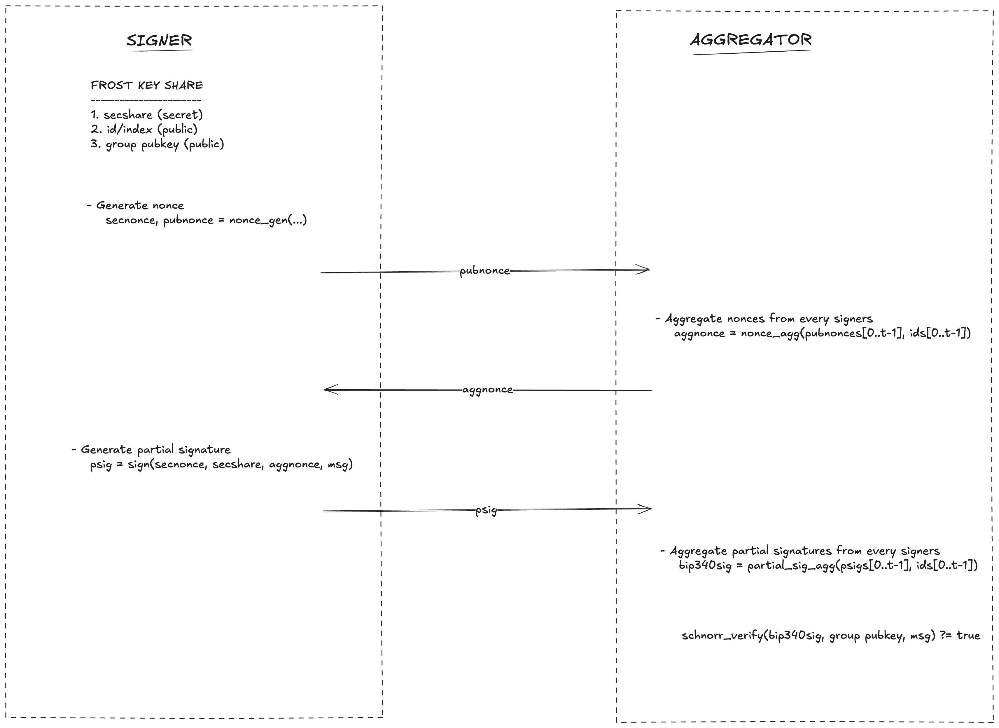

# Build
```bash
git clone https://github.com/siv2r/bip-frost-signing.git
git checkout boss-workshop
cd workshop
```

# Workshop Task Description
In this workshop you will work in teams of three to walk through a full 2-of-3 FROST signing session using the reference implementation. I (the moderator) will act as the trusted dealer and hand each team the key material generated by `workshop/dealer.py`: the group public key, the participant identifiers, and every signer’s secret share and public share.

Inside each team, two members take the signer roles (participant IDs 0 and 1) and the remaining member acts as the aggregator. Signers edit `workshop/signer.py`, completing the TODOs to generate their nonces, exchange pubnonces, and produce partial signatures. The aggregator edits `workshop/aggregator.py`, filling in the TODOs to combine the pubnonces, verify partial signatures, and derive the final Schnorr signature.

All communication between signers and the aggregator is manual—share the hex blobs the scripts print during each round exactly as the code requests. Once both rounds are finished, the aggregator verifies the final signature using the provided group public key. If the verification succeeds, your team has successfully executed the FROST signing protocol.

## Signer Task
- `TODO 1.1`: Paste the identifier, secret share, public share, and message provided by the dealer
- `TODO 1.2`: Call `frost.nonce_gen(...)` with those inputs to produce a private `secnonce` and a shareable `pubnonce`.
- Run `python3 signer.py round1` for nonce generation
- `TODO 2.1`: After the aggregator replies, paste the aggregated nonce, the ordered participant IDs, and each signer’s pubshare and pubnonce.
- `TODO 2.2`: Call `frost.sign(...)` with your secnonce, secret share, identifier, and `SessionContext` to emit your partial signature, then share the printed hex back to the aggregator.
- Run `python3 signer.py round2` for signing once the required inputs are filled in.

## Aggregator Task
- `TODO 1.1`: Paste the group public key and message the dealer supplied.
- `TODO 1.2`: Record the two pubnonces you receive from signers 0 and 1 (keep the order aligned with `PARTICIPANT_IDS`).
- `TODO 1.3`: Call `frost.nonce_agg(...)` with the collected pubnonces and IDs to derive the aggregated nonce; share that value back with both signers.
- Run `python3 aggregator.py round1` to perform nonce aggregation
- `TODO 2.1`: After both signers respond, paste their partial signatures along with the corresponding pubshares.
- `TODO 2.2`: Use `frost.partial_sig_agg(...)` to combine the partials, then verify the resulting Schnorr signature with `schnorr_verify(...)`.
- Run `python3 aggregator.py round2` to create the final schnorr signature.

# FROST Signing Workflow


# API Documentation
#### frost.nonce_gen

```python
def nonce_gen(
    secshare: Optional[bytes],
    pubshare: Optional[PlainPk],
    group_pk: Optional[XonlyPk],
    msg: Optional[bytes],
    extra_in: Optional[bytes],
) -> Tuple[bytearray, bytes]
```

Derive a signer’s per-round secret nonce and the corresponding public nonce for a FROST session.

*Arguments*:

- `secshare` - Signer’s 32-byte secret share; required when generating an interactive nonce.
- `pubshare` - Signer’s 33-byte public share that matches `secshare`.
- `group_pk` - X-only group public key (32 bytes) used for binding the nonce.
- `msg` - Message bytes that will be signed; include `None` when the message is undecided.
- `extra_in` - Optional 32-byte random salt; set to `None` for fresh randomness.

*Returns*:

- `bytearray` - The 64-byte secret nonce (two scalars) that must remain private and is zeroed after signing.
- `bytes` - The 66-byte public nonce to be shared with other participants or the aggregator.

#### frost.sign

```python
def sign(
    secnonce: bytearray,
    secshare: bytes,
    my_id: int,
    session_ctx: SessionContext,
) -> bytes
```

Produce a signer’s partial Schnorr signature for the current FROST session.

*Arguments*:

- `secnonce` - The mutable secret nonce produced by `nonce_gen`; it is overwritten with zeros after use.
- `secshare` - The signer’s 32-byte secret share.
- `my_id` - Signer identifier (integer) that matches the ordering in the session context.
- `session_ctx` - `SessionContext` carrying the aggregated nonce, participant list, pubshares, tweaks, and message.

*Returns*:

- `bytes` - The signer’s 32-byte partial signature to be sent to the aggregator.

#### frost.nonce_agg

```python
def nonce_agg(pubnonces: List[bytes], ids: Sequence[Optional[int]]) -> bytes
```

Combine multiple public nonces into a single aggregated nonce for the session.

*Arguments*:

- `pubnonces` - Ordered list of 66-byte public nonces received from the participating signers.
- `ids` - Matching sequence of participant identifiers for each public nonce (use the same order as `pubnonces`).

*Returns*:

- `bytes` - The 66-byte aggregated nonce to be shared back with all signers.

#### frost.partial_sig_agg

```python
def partial_sig_agg(psigs: List[bytes], ids: List[int], session_ctx: SessionContext) -> bytes
```

Aggregate verified partial signatures into the final Schnorr signature under the current session parameters.

*Arguments*:

- `psigs` - List of 32-byte partial signatures from the participating signers.
- `ids` - Ordered participant identifiers corresponding to the partial signatures.
- `session_ctx` - `SessionContext` containing the aggregated nonce, participant list, pubshares, tweaks, and message.

*Returns*:

- `bytes` - The 64-byte Schnorr signature (`R‖s`) ready for network or on-chain validation.
