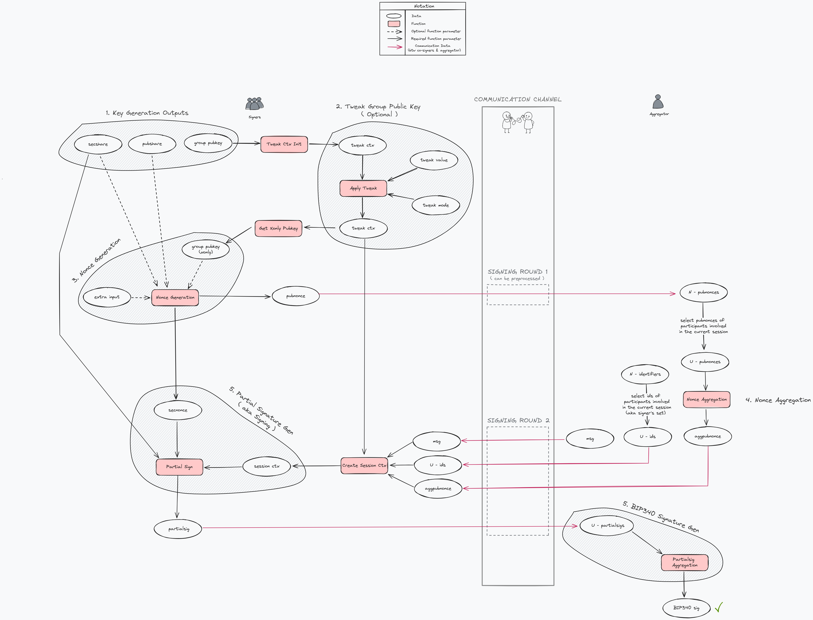

# Design Decisions

This document provides additional reasoning behind the major design decisions in the BIP and lists alternative designs for consideration.

## Signing Flow

## Current Design

### Key Generation

We aim to represent $(t, n)$ FROST keys using [1] input/output arguments of keygen and [2] conditions that output arguments must satisfy (see definition 2.5 in the [ROAST paper](https://eprint.iacr.org/2022/550.pdf)). This representation should be easy to understand without sacrificing precision. I am currently trying to improve the way we represent correctness conditions. At present, we represent them in an English-math like language to make it easier for non-mathematicians to understand. However, I am open to other ways to represent them. Here are two alternatives:

Alternative 1: We could represent these conditions using boolean functions. In this case, we would say that the key generation is compatible with this BIP if these functions return true.

Alternative 2: Since Github supports LaTeX, could we represent these conditions as LaTeX equations? Does BIP allow for this?

### No Key Sorting

MuSig2's [KeyAgg](https://github.com/bitcoin/bips/blob/master/bip-0327.mediawiki#user-content-Key_Generation_and_Aggregation) produces an aggregate public key (aka group public key), which depends on the order of the individual public keys. To ensure that the aggregate public key is independent of the individual public key order, it provides a [KeySort](https://github.com/bitcoin/bips/blob/master/bip-0327.mediawiki#user-content-Key_Sorting) mechanism. This mechanism defines a canonical order, which ensures that the aggregate public key remains the same regardless of the order of individual public keys.

In FROST, the order of the public shares does not affect the group public key created by aggregating the signer's public share, so no sorting mechanism is needed.

### Group Pubkey Type

If a key generation method produces a group public key incompatible with BIP340 (i.e., a plain pubkey), it doesn't automatically render the method incompatible with our signing protocol. Hence, in the [participant parameters section](README.md#participant-parameters), we define the group public key type as `PlainPk` (33 bytes) instead of `XonlyPk` (32 bytes). For example, BIP-FROST-DKG outputs a `PlainPk` not `XonlyPk`.

It is crucial to note that the signatures generated through our [signing protocol](README.md#signing) are only verifiable with a BIP340 compatible pubkey. Therefore, if you are using a key generation method that outputs a `PlainPk` type group pubkey, you need to convert it to `XonlyPk` using the [`secp256k1_xonly_pubkey_from_pubkey`](https://github.com/bitcoin-core/secp256k1/blob/master/include/secp256k1_extrakeys.h#L93) API.

### Tweak Context

To ensure compatibility with various key generation methods, we have avoided the KeyAgg context mentioned in MuSig2 BIP. Instead, we define the Tweak Context, which must be initialized with the group public key when users wish to tweak it.

### No Mandatory PK in Nonce Generation

MuSig2 requires the public key to be given as an input argument for nonce generation. This is done to prevent a vulnerability that arises when a user attempts to sign with their tweaked individual public key. ( See [mailing list](https://lists.linuxfoundation.org/pipermail/bitcoin-dev/2022-October/021000.html) & [this bip324 section](https://github.com/bitcoin/bips/blob/master/bip-0327.mediawiki#signing-with-tweaked-individual-keys)).

On the other hand, FROST does not have a non-interactive key aggregation mechanism like MuSig2, which means this vulnerability does not affect it. Hence, we do not mandate the public share argument during nonce generation.

### Nonce Aggregation

We use the nonce aggregation technique described in the FROST3 scheme (see section 2.3 in [ROAST paper](https://eprint.iacr.org/2022/550.pdf)), which is a variant of the original [FROST](https://eprint.iacr.org/2020/852.pdf). The advantage of using FROST3 is that all co-signers involved in the signing process share the same binding factor, which makes the nonce aggregation process simpler.

An alternative approach is to follow the original FROST protocol, where the aggregator does not perform the aggregation. Instead, it sends the set $\bigcup \limits_{i=1}^{u}{(i, R_{i, 1}, R_{i, 2})}$ to each signer. The disadvantage is that the size of this set is $(32+33+33) \times u$ bytes, which is larger than the 66-byte aggregate nonce sent in the FROST3 scheme. The advantage is that signers can detect a malicious aggregator when their nonce commitment is absent in this set. However, this detection mechanism cannot validate the set when some signers collude with the malicious aggregator.

### Session Context Structure

There are two ways to store the group public key in the Session context data structure.
- Option 1: The Session context contains individual public shares for each participant involved in the signing process. Whenever we need the group public key, we call the _GetSessionGroupPubkey_ algorithm.
- Option 2: The Session context contains the group public key itself.

I chose Option 1 because it fits nicely with the _PartialSigVerify_ algorithm which requires the list of individual public shares.

## Some Bike Shedding
- how to write out inverse in lagrange coeff calc?
  - simply power -1
  - power power n-2
    - easy to follow
    - but makes it unclear that we are computing inverse
//todo: ask this on trusted dealer pr review...
- what should be limit for MAX_PARTICIPANTS?
  - we should use 32-byte array for it
  - The frost draft says this:
    > MAX_PARTICIPANTS MUST be a positive integer less than the group order
- hash tag for b, "noncecoef" vs "noncecoeff"
  - follow musig2. It uses "noncecoef"

## Todo List
- [ ] reference implementation & test vectors
  - [ ] should the participant identifier be inside [1] secshare, [2] pubshare, [3] both, or [4] as a separate list?
    - we require the identifiers for computing the interpolating value of every signing in the signing set
    - Note: In an ordered list of secshares or pubshares, we can assume the identifiers as 1, 2, 3.. (like MuSig2 does)
      - because it could be the shares of participants 2, 7, 5 and not necessarily 1, 2, 3.
    - Trusted dealer FROST example uses an `ids[THRESHOLD]` array while signing
  - [ ] define `NewType` for secshare and pubshare? or simply use `bytes` & `PlainPk`?
  - [ ] In MuSig2's code, `InvalidContribution` can have e.signer = 0. Can we allow it?
- [x] flowchart for general signing flow
- [ ] improve FROST key representation
- [ ] deterministic sign?
- [ ] which params should we hash (i.e. commit to), while generating nonces k1 & k2
  - we currently do k_i = H(rand || pubshare || group_pk || msg || extra_in || i)
  - why not include n & t? MuSig2 doesn't include n though.
  - how to decide these params
- [ ] In BIP327, return type missing in `key_agg_and_tweak`
- [ ] add footnotes